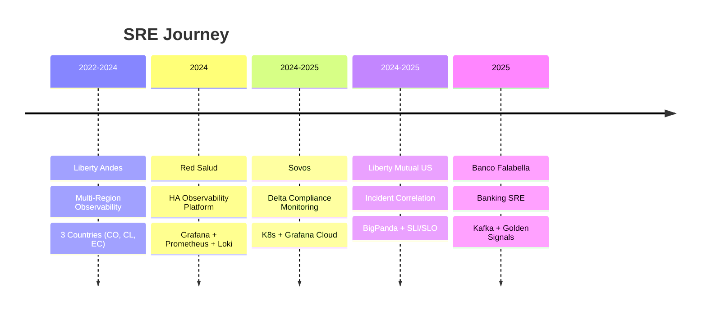

<!-- ANIMATED HEADER -->
<div align="center">
  
</div>

<!-- TYPING SVG -->
<div align="center">
  <a href="https://git.io/typing-svg"></a>
</div>

<!-- SOCIAL BADGES -->
<div align="center">
  <a href="https://linkedin.com/in/fabianimv">
    
  </a>
  <a href="mailto:fabianignaciomv@gmail.com">
    
  </a>
  <a href="https://fabianimv.github.io/portfolio">
    
  </a>
  
</div>

<br/>

<!-- ABOUT ME -->


## 🎯 About Me

```yaml
name: Fabián M.
role: Site Reliability Engineer
company: Banco Falabella 🏦
location: Santiago, Chile 🇨🇱
experience: 3+ years in Observability & Monitoring
focus:
  - Critical Banking Infrastructure
  - Kafka & Transaction Processing Systems
  - Golden Signals (Latency, Traffic, Errors, Saturation)
  - 24/7 Financial Services Reliability
education: Computer Engineering @ Duoc UC (4th year)
```

<br clear="right"/>

<!-- CURRENT ROLE -->
## 🏦 Current Role

<div align="center">
  <table>
    <tr>
      <td align="center">
        
        <br/><br/>
        <b>Site Reliability Engineer</b>
        <br/>
        <sub>Oct 2025 - Present | Hybrid</sub>
        <br/><br/>
        
        
        
        
        
        
      </td>
    </tr>
  </table>
</div>

> *Specializing in observability and monitoring for critical banking infrastructure. Working with Kafka message queues, transaction processing systems, and implementing golden signals monitoring for 24/7 financial services reliability.*

<!-- EXPERIENCE TIMELINE -->
## 💼 Experience



<!-- FEATURED PROJECTS -->
## 🏗️ Key Projects

<table>
<tr>
<td width="50%">
<h3 align="center">🔭 Delta Compliance Monitoring</h3>
<p align="center">
  
  
  
</p>
<p align="center"><em>Enterprise K8s observability with dashboards for RabbitMQ, Redis, AWS RDS & S3</em></p>
</td>
<td width="50%">
<h3 align="center">🔥 Incident Correlation</h3>
<p align="center">
  
  
  
</p>
<p align="center"><em>Root cause analysis, SLI/SLO framework & noise reduction for financial services</em></p>
</td>
</tr>
</table>

<!-- TECH STACK -->
## ⚡ Tech Stack

<div align="center">

| **Observability** | **Cloud & Infra** | **DevOps** | **Languages** |
|:---:|:---:|:---:|:---:|
|  |  |  |  |
|  |  |  |  |
|  |  |  |  |
|  |  |  |  |

</div>

<!-- CERTIFICATIONS -->
## 🏅 Certifications

<div align="center">
  
  
  
  
</div>

<!-- GITHUB STATS -->
## 📊 GitHub Analytics

<div align="center">
  
  
</div>

<div align="center">
  
</div>

<!-- ACTIVITY GRAPH -->
<div align="center">
  
</div>

<!-- TROPHIES -->
<div align="center">
  
</div>

<!-- SNAKE -->
<picture>
  <source media="(prefers-color-scheme: dark)" srcset="https://raw.githubusercontent.com/FabianIMV/FabianIMV/output/github-contribution-grid-snake-dark.svg"/>
  <source media="(prefers-color-scheme: light)" srcset="https://raw.githubusercontent.com/FabianIMV/FabianIMV/output/github-contribution-grid-snake.svg"/>
  
</picture>

<!-- FOOTER -->
<div align="center">
  
</div>

<!-- QUOTE -->
<div align="center">
  
</div>

---

<div align="center">
  <b>💬 Let's connect and build observable systems together!</b>
  <br/><br/>
  <a href="mailto:fabianignaciomv@gmail.com">
    
  </a>
</div>