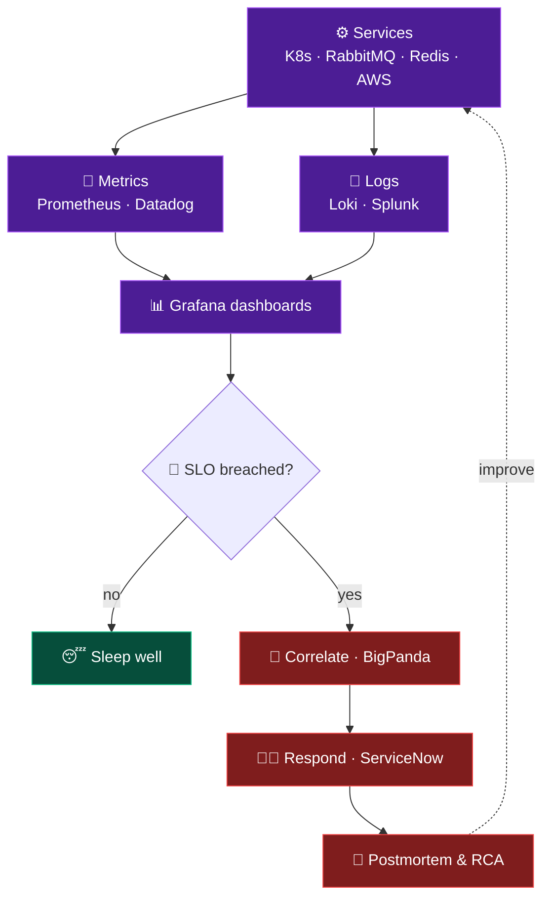

<!-- ═══════════════════════════════ HEADER ═══════════════════════════════ -->
<div align="center">
  
</div>

<div align="center">
  <a href="https://git.io/typing-svg"></a>
</div>

<div align="center">
  <a href="https://linkedin.com/in/fabianimv"></a>
  <a href="mailto:fabianignaciomv@gmail.com"></a>
  <a href="https://fabianimv.github.io/portfolio"></a>
  
  <br/>
  <br/>
  
  <br/>
  <sub>🚨 <b>Severity: awesome.</b> You've been paged — welcome to my profile! 👋</sub>
</div>

<br/>

<!-- ═══════════════════════════════ STATUS PAGE ═══════════════════════════════ -->
## 🟢 `fabian.prod` — System Status

> _All systems operational._ This profile is monitored 24/7 by caffeine-driven synthetic checks.

| Service | Status |
| :-- | :--: |
| 🔭 **Observability & Monitoring**<br/><sub>Dashboards, alerts & pipelines at scale · `3+ yrs uptime`</sub> |  |
| 🚨 **Incident Response**<br/><sub>Root cause over quick fixes · `MTTR ↓`</sub> |  |
| 📐 **SLI / SLO Engineering**<br/><sub>Latency · traffic · errors · saturation · `99.9%`</sub> |  |
| ☁️ **Cloud & IaC**<br/><sub>AWS · GCP · Terraform / OpenTofu · `plan ✔`</sub> |  |
| 📚 **Learning Pipeline**<br/><sub>Always shipping new skills · `continuous`</sub> |  |
| ☕ **Coffee Saturation**<br/><sub>Refill scheduled, no action needed · `< 90%`</sub> |  |

<!-- ═══════════════════════════════ ABOUT ═══════════════════════════════ -->
## 👨‍💻 `$ kubectl describe engineer fabian`

```yaml
apiVersion: human/v1
kind: SiteReliabilityEngineer
metadata:
  name: fabian-m
  namespace: santiago-chile 🇨🇱
  labels:
    role: sre
    specialty: observability
    experience: 3y+
spec:
  education: Computer Engineer @ Duoc UC 🎓
  languages:
    - Spanish (native) 🇨🇱
    - English (professional) 🇺🇸
  focus:
    - High-Availability Systems
    - Golden Signals
    - SLI/SLO & MTTR Optimization
    - Incident & Root Cause Analysis
status:
  phase: Running ✅
  workingOn: 🔭 Observability at scale
  askMeAbout:
    - SLOs
    - Grafana
    - Incident Management
    - Alert noise reduction
```

<!-- ═══════════════════════════════ HOW I WORK ═══════════════════════════════ -->
## 🧭 How I Make Systems Observable


```mermaid
flowchart TD
    A["⚙️ Services<br/>K8s · RabbitMQ · Redis · AWS"] --> B["📡 Metrics<br/>Prometheus · Datadog"]
    A --> C["📜 Logs<br/>Loki · Splunk"]
    B --> D["📊 Grafana dashboards"]
    C --> D
    D --> E{"🎯 SLO breached?"}
    E -- no --> F["😴 Sleep well"]
    E -- yes --> G["🚨 Correlate · BigPanda"]
    G --> H["🧑‍🚒 Respond · ServiceNow"]
    H --> I["📝 Postmortem & RCA"]
    I -. "improve" .-> A

    classDef ok fill:#064E3B,stroke:#10B981,color:#fff
    classDef alert fill:#7F1D1D,stroke:#EF4444,color:#fff
    classDef core fill:#4C1D95,stroke:#A855F7,color:#fff
    class A,B,C,D core
    class F ok
    class G,H,I alert
```

<!-- ═══════════════════════════════ PROJECTS ═══════════════════════════════ -->
## 🏗️ Key Projects

> ### 🔭 Enterprise K8s Observability
>   
>
> Observability architecture with dashboards for K8s, RabbitMQ, Redis, AWS RDS & S3.

> ### 🔥 Incident Correlation Engine
>   
>
> Root cause analysis, SLI/SLO framework & alert noise reduction.

> ### 📊 HA Monitoring Platform
>   
>
> High-availability architecture with centralized logging & synthetic monitors.

> ### 🌎 Multi-Region Observability
>   
>
> Infrastructure monitoring across multiple regions with IaC deployment.

<!-- ═══════════════════════════════ STACK ═══════════════════════════════ -->
## ⚡ Tech Stack

<div align="center">
  
  <br/><br/>
  
  
  
  
  
  
</div>

<!-- ═══════════════════════════════ CERTS ═══════════════════════════════ -->
## 🏅 Certifications

<div align="center">
  
  
  
  
  
</div>

<!-- ═══════════════════════════════ ACTIVITY ═══════════════════════════════ -->
## 📈 Telemetry

<div align="center">
  <picture>
    <source media="(prefers-color-scheme: dark)" srcset="https://github-readme-activity-graph.vercel.app/graph?username=FabianIMV&custom_title=Contribution%20Metrics&bg_color=0D1117&color=A855F7&line=A855F7&point=FFFFFF&area_color=A855F7&area=true&hide_border=true"/>
    <source media="(prefers-color-scheme: light)" srcset="https://github-readme-activity-graph.vercel.app/graph?username=FabianIMV&custom_title=Contribution%20Metrics&theme=minimal&area=true&hide_border=true"/>
    
  </picture>
</div>

<div align="center">
  <picture>
    <source media="(prefers-color-scheme: dark)" srcset="https://raw.githubusercontent.com/FabianIMV/FabianIMV/output/github-contribution-grid-snake-dark.svg"/>
    <source media="(prefers-color-scheme: light)" srcset="https://raw.githubusercontent.com/FabianIMV/FabianIMV/output/github-contribution-grid-snake.svg"/>
    
  </picture>
  <br/>
  <sub>🐍 A snake eating my contributions — the only acceptable kind of data loss.</sub>
</div>

<!-- ═══════════════════════════════ ON-CALL ═══════════════════════════════ -->
## 📟 On-Call Runbook

<details>
<summary><b>🚨 Need an SRE? Click to open the runbook</b></summary>

<br/>

```bash
# Step 1 — Identify the issue
$ echo "Need better observability"

# Step 2 — Escalate to the right person
$ page --to "Fabián M." --severity "let's-talk" \
       --channel linkedin.com/in/fabianimv \
       --fallback fabianignaciomv@gmail.com

# Step 3 — Resolution
✔ Dashboards built
✔ SLOs defined
✔ Alert noise reduced
✔ Team sleeps well
```

</details>

<div align="center">
  <h3>💬 Let's connect and build observable systems together!</h3>
  <a href="https://linkedin.com/in/fabianimv"></a>
  <a href="mailto:fabianignaciomv@gmail.com"></a>
</div>

<!-- ═══════════════════════════════ FOOTER ═══════════════════════════════ -->
<div align="center">
  
</div>
